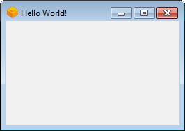
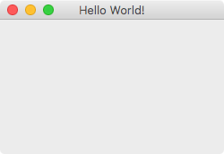
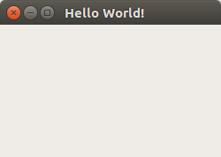
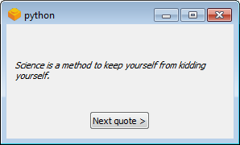

# fbs tutorial
This tutorial shows how you can use fbs to create a simple Python GUI and an
associated installer. You can follow it on Windows, Mac or Linux. The only
prerequisite is
[Python 3.5](https://www.python.org/downloads/release/python-354/).
(Other versions have known issues and are not yet supported.)

## Setup
Create a virtual environment in the current directory:

    python3 -m venv venv

Activate the virtual environment:

    # On Mac/Linux:
    source venv/bin/activate
    # On Windows:
    call venv\scripts\activate.bat

The remainder of the tutorial assumes that the virtual environment is active.

Install the required libraries (most notably, `fbs` and `PyQt5`):

    pip install fbs PyQt5==5.9.2 PyInstaller==3.3.1

## Start a project
Execute the following command to start a new fbs project:

    python -m fbs startproject

This asks you a few questions. You can for instance use `Tutorial` as the app
name, your name as the author and `com.example.tutorial` as the Mac bundle
identifier.

The command creates a new folder called `src/` in your current directory.
This folder contains the minimum configuration for a bare-bones PyQt app.

## Run the app
To run the basic PyQt application from source, execute the following command:

    python -m fbs run

This shows a (admittedly not very exciting) window. Screenshots on
Windows/Mac/Ubuntu:

  

## Source code of the sample app
Let's now take a look at the source code of the PyQt app that was generated.
It is at
[`src/main/python/main.py`](https://github.com/mherrmann/fbs/blob/master/fbs/builtin_commands/project_template/src/main/python/main.py):

```python
from fbs_runtime.application_context import ApplicationContext
from PyQt5.QtWidgets import QMainWindow

import sys

class AppContext(ApplicationContext):           # 1. Subclass ApplicationContext
    def run(self):                              # 2. Implement run()
        window = QMainWindow()
        window.setWindowTitle('Hello World!')
        window.resize(250, 150)
        window.show()
        return self.app.exec_()                 # 3. End run() with this line

if __name__ == '__main__':
    appctxt = AppContext()                      # 4. Instantiate the subclass
    exit_code = appctxt.run()                   # 5. Invoke run()
    sys.exit(exit_code)
```

The important steps are highlighted as comments. If they look daunting to you,
don't worry. They're the only boilerplate that's required. In the middle of the
code, you can see that a window is being created, resized and then shown.

## Freezing the app
We want to turn the source code of our app into a standalone executable that can
be run on your users' computers. In the context of Python applications, this
process is called "freezing".

Use the following command to turn the app's source code into a standalone
executable:

    python -m fbs freeze

This creates the folder `target/Tutorial`. You can copy this directory to any
other computer (with the same OS as yours) and run the app there! Isn't that
awesome?

## Creating an installer
Desktop applications are normally distributed by means of an installer.
On Windows, this would be an executable called `TutorialSetup.exe`.
On Mac, mountable disk images such as `Tutorial.dmg` are commonly used.
fbs lets you generate both of these files.

### Windows installer
To create an installer on Windows, please first install
[NSIS](http://nsis.sourceforge.net/Main_Page) and add its directory to your
`PATH` environment variable. Then, you can run the following command:

    python -m fbs installer

This creates an installer at `target/TutorialSetup.exe`. It lets your users pick
the installation directory and adds your app to the Start Menu. It also creates
an entry in Windows' list of installed programs. Your users can use this to
uninstall your app. The following screenshots show these steps in action.

   

  

### Mac installer
Creating an installer on Mac is done with the same command as on Windows:

    python -m fbs installer

This creates the file `target/Tutorial.dmg` for distribution to your users.
Upon opening it, the following volume is displayed:


To install your app, your users simply drag its icon to the _Applications_
folder (also shown in the volume).

## A more complicated example
We will now create a more interesting example: An app that displays famous
quotes from the internet. Here's what it looks like (on Ubuntu):



Before you can run it, you need to install the Python
[requests](http://docs.python-requests.org/en/master/) library. To do this,
type in the following command:

    pip install requests

The source code of the new app consists of two files:
 * [`main.py`](https://raw.githubusercontent.com/mherrmann/fbs-tutorial/master/main.py)
 * [`styles.qss`](https://raw.githubusercontent.com/mherrmann/fbs-tutorial/master/styles.qss)

Please copy the former over the existing file in `src/main/python/`, and the
latter into the _new_ directory `src/main/resources/base/`. Once you have done
this, you can do `python -m fbs run` (or `... freeze` etc.) as before.

The new app uses the following code to fetch quotes from the internet:

```python
def _get_quote():
    response = requests.get('https://talaikis.com/api/quotes/random/')
    return response.json()['quote']
```

You can see that it uses the `requests` library we just installed above. Feel 
free to open https://talaikis.com/api/quotes/random/ in the browser to get a
feel for its data.

The app follows the same basic steps as before. It defines an application
context with a `run()` method that ends in `return self.app.exec_()`:

```python
class AppContext(ApplicationContext):
    def run(self):
        ...
        return self.app.exec_()
    ...
```

It then instantiates this application context and invokes `run()`:

```python
if __name__ == '__main__':
    appctxt = AppContext()
    exit_code = appctxt.run()
    sys.exit(exit_code)
```

What's different is what happens in between. First, let's look at the 
implementation of `run()`:

```python
def run(self):
    stylesheet = self.get_resource('styles.qss')
    self.app.setStyleSheet(open(stylesheet).read())
    self.window.show()
    return self.app.exec_()
```

The first line uses
[`get_resource(...)`](https://build-system.fman.io/manual/#get_resource) to
obtain the path to [`styles.qss`](styles.qss). This is a QSS file, Qt's
equivalent to CSS. The next line reads its contents and sets them as the
stylesheet of `self.app`.

fbs ensures that `get_resource(...)` works both when running from source (i.e.
during `python -m fbs run`) and when running the compiled form of your app. In
the former case, the returned path is in `src/main/resources`. In the latter, it
will be in your app's installation directory. fbs handles the corresponding
details transparently.

The last but one line accesses `self.window`. This is defined as follows:

```python
@cached_property
def window(self):
    return MainWindow()
```

You can use
[`@cached_property`](https://build-system.fman.io/manual/#cached_property) to
define the components that make up your app. The way it works is that the first
time `self.window` is accessed, `return MainWindow()` is executed. Further
accesses then cache the value and return it without re-executing the code.

The above approach is extremely useful: In your `ApplicationContext`, define a
`@cached_property` for each component (a window, a database connection, etc.).
If it requires other objects, access them as properties. For example, if the
window requires the database because it displays information from it, then its
`@cached_property` would access `self.database`. If you connect the parts of
your application in this centralised way, then it is extremely easy to see how
they work together.

The final bit of code is the definition of `MainWindow`. It sets up the text
field for the quote and the button. When the button is clicked, it changes the
contents of the text field using `_get_quote()` above. You can find the
corresponding code in [`main.py`](main.py).

As already mentioned, you can use `python -m fbs run` to run the new app. But
here's what's really cool: You can also do `python -m fbs freeze` and
`... installer` to distribute it to other computers. fbs includes the `requests`
dependency and the `styles.qss` file automatically.

## Summary
fbs lets you use Python and Qt to create desktop applications for Windows, Mac
and Linux. It can create installers for your app, and automatically handles the
packaging of third-party libraries and data files. These things normally take
weeks to figure out. fbs gives them to you in minutes instead.

## Where to go from here
fbs's [Manual](https://build-system.fman.io/manual/) explains the technical
foundation of the steps in this tutorial. Read it to find out more about fbs's
required directory structure, dependency management, handling of data files,
custom build commands, API and more.

If you have not used PyQt before: It's the library that allowed us in the above
examples to use Qt (a GUI framework) from Python. fbs's contribution is not to
combine Python and Qt. It's to make it very easy to package and deploy
PyQt-based apps to your users' computers. For an introduction to PyQt, see
[here](https://build-system.fman.io/pyqt5-tutorial).

Feel free to share the link to this tutorial! If you are not yet on fbs's
mailing list and want to be notified as it evolves,
[sign up here](https://emailoctopus.com/lists/5061ca0f-33e0-11e8-a3c9-06b79b628af2/forms/subscribe).